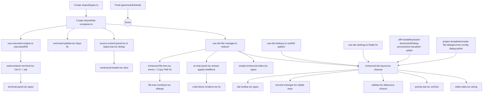

# IDE Enterprise-Grade Refactor Plan

**Status:** Audit complete, ready for implementation
**Goal:** Fix all bugs and refactor to enterprise-grade quality across 26 IDE components + 4 hooks + 3 chat sub-components.
**Constraint:** Preserve all existing behavior — no functional changes, only correctness, type-safety, performance, and structural cleanup.

---

## 1. Executive Summary

The IDE surface (26 components, 4 hooks, 3 chat sub-components) has been fully audited. **14+ concrete defects** were identified ranging from race conditions and stale closures to type-safety holes and dead code. The work is decomposed into **24 atomic tasks** that can be executed in dependency order, with shared foundation modules built first.

**Architecture Decision:** Introduce a `src/components/ide/shared/` directory containing:
- `types.ts` — Domain types (`IDEFile`, `IDELanguage`, `FileAction`, `SidebarTab`, `Secret`, `IDEUser`, etc.)
- `ide-constants.ts` — Pure utilities (`getLanguageFromFileName`, `slugifyProjectName`, `parseGitStatus`, `toWorkspaceRelativePath`, `extractTopLevelFolders`)

This eliminates the ~5 places that currently inline `getLanguageFromFileName`/`slugifyProjectName`, the duplicate `parseGitStatus` in `status-bar.tsx` and `source-control-panel.tsx`, and provides a single home for the new `IDELanguage` union type that replaces scattered `string` language props.

---

## 2. Bug Inventory (Ranked by Severity)

### Critical (correctness / data integrity)

| # | File | Defect | Fix |
|---|------|--------|-----|
| C1 | `src/hooks/use-ide-file-manager.ts:81-98` | `removeFile` uses 3 sequential `setState` calls — race condition can leave `openFiles` referencing a file that no longer exists in `files`. | Atomic `useReducer` action `REMOVE_FILE`. |
| C2 | `src/hooks/use-ide-file-manager.ts:134-141` | `handleCloseFile` mutates `openFiles` separately from `activeFileId` — can leave `activeFileId` pointing to a file that is no longer open. | Same reducer pattern; clear `activeFileId` when active tab is closed. |
| C3 | `src/hooks/use-ide-file-manager.ts:107-132` | `handleFileSelect` lacks inflight dedup; rapid double-clicks cause duplicate fetches and stale state. | Track `inflightRef` per `fileId`, abort if already in flight. |
| C4 | `src/hooks/use-ide-file-manager.ts:19-28` | `useMemo` dep `initialFiles` is mutable; `initialFileContents` resets every time parent re-renders with new array reference, wiping unsaved-content cache. | Compute lazily on demand; cache by file id, not memoize the map. |
| C5 | `src/hooks/use-execution-engine.ts:140-198` | `bootRuntime` has `mountAll` in its `useCallback` deps; combined with effect re-running on every file change, this remounts the entire WebContainer on every keystroke. | Stabilize via `mountAllRef` (latest-ref pattern); call from effect with stable identity. |
| C6 | `src/hooks/use-execution-engine.ts:34-120` | `termRef` polling loop (`20 × 100ms`) has no cancellation if WebContainer fails to boot — wastes CPU and leaks the interval if the component unmounts mid-poll. | `AbortController` + `setTimeout` chain with cleanup. |
| C7 | `src/hooks/use-execution-engine.ts:127-138` | Path-validation regex `name.match(/^[a-zA-Z0-9@._\-\/]+$/)` allows `../` traversal (`/`) and absolute paths. | Use existing `toWorkspaceRelativePath` utility which already strips absolute prefixes; add a strict allowlist check. |
| C8 | `src/components/ide/ai-chat-panel.tsx:135-216` | `handleApplyCode` is a 70+ line function with 3 nested `try/catch` blocks and 3 separate `setUndoStack` invocations that diverge in shape. | Extract into pure `applyCodeBlock(block, files, contents)` function returning `{ updatedFiles, undoEntry }`; keep hook thin. |
| C9 | `src/components/ide/ai-chat-panel.tsx:460` | `isNewFile` logic broken: `!allFiles?.some(f => f.name === block.fileName || block.code.includes("import ") && !activeFileId)` — `&&` precedence makes the `!activeFileId` term stick to the inner `||`, and an existing file with `import` will be misclassified as new. | Replace with `const known = allFiles?.some(f => f.name === block.fileName); const isNewFile = !known;` |
| C10 | `src/components/ide/ai-chat-panel.tsx:489-499` | O(n²) streaming: `extractCodeBlocks(m.content + responseText)` re-parses entire accumulated message on every chunk. | Track `lastExtractedIndex` and only parse from there, or move to incremental regex capture. |
| C11 | `src/components/ide/ai-chat-panel.tsx` | `additionalContext.substring(0, 5000)` blindly truncates after the first 5KB; mentioned files referenced later in the same context are silently dropped. | Truncate per-file to fit budget (e.g. 1KB each) with a `[+N more files]` summary. |
| C12 | `src/components/ide/enhanced-file-tree.tsx:199-203` | **UX bug** — both "Copy Name" and "Copy Path" use the `Copy` icon and copy the same name; the user-visible label is the only differentiator. | Wire "Copy Path" to actually copy the full path. |

### High (UX / state hygiene)

| # | File | Defect | Fix |
|---|------|--------|-----|
| H1 | `src/components/ide/contextual-header.tsx` | `pathParts.pop()` mutates the array passed in by the parent. | `const last = pathParts[pathParts.length - 1]; const rest = pathParts.slice(0, -1);` |
| H2 | `src/components/ide/activity-bar.tsx:46` | Settings button has no `onClick` — dead UI. | Either wire it to `onTabClick("settings")` or add a dedicated `onOpenSettings` prop. |
| H3 | `src/components/ide/sidebar.tsx:63-70` | Debounce `useEffect` reads `searchQuery` from a stale closure (deps are stale). | Add `searchQuery` to deps or use a `useRef` for the latest value. |
| H4 | `src/components/ide/webcontainer-terminal.tsx:92-110` | `term.onData` writes raw input to `currentCommand` without ever emitting `\u0003` (Ctrl+C) or handling tab-completion; pressing Ctrl+C appends literal `^C`. | Intercept `\u0003` → `term.write('^C\r\n$ ')` and reset `currentCommand`; add tab handler. |
| H5 | `src/components/ide/webcontainer-terminal.tsx` | `disabled` `<button>` with `cursor-not-allowed` does not block the underlying xterm input — terminal remains interactive. | Move the disabled state into the xterm `.write('')` gate and gate the xterm input via `term.setOption("disableStdin", disabled)`. |
| H6 | `src/components/ide/command-palette.tsx:60-91` | `useEffect` deps include `totalItems`; keydown handler re-binds on every selection. | Read latest items via a ref; deps: `[]`. |
| H7 | `src/components/ide/chat/code-block-renderer.tsx` | `block.code.split('\\n')` is the literal 2-character sequence `\n` (escape), not a newline. | `block.code.split('\n')`. |
| H8 | `src/hooks/use-ide-settings.ts:35-72` | `initialLoadDone.current = true` mutated inside `finally` — should be inside `try`'s success path to avoid masking a real failure. | Move into success branch. |
| H9 | `src/hooks/use-ide-hotkeys.ts:18-66` | `dependencies: any[]` is weakly typed. | Replace with `useRef<HotkeyActions>(actions)`; read latest via ref to keep `[]` deps stable. |
| H10 | `src/hooks/use-ide-file-manager.ts:120-125` | Dead `try/catch` around `setFileContents` — `useState` setters never throw. | Remove. |

### Medium (code quality)

| # | File | Defect | Fix |
|---|------|--------|-----|
| M1 | `src/components/ide/enhanced-ide-layout.tsx:1-50` | ~20 unused imports including `RunnerConfigDialog` and a host of `lucide-react` icons. | Run a tree-shake pass; remove dead imports. |
| M2 | `src/components/ide/enhanced-ide-layout.tsx:109-110` | `clickTimeout` state declared but never read. | Remove. |
| M3 | `src/components/ide/enhanced-ide-layout.tsx:209-225` | Two near-identical `useEffect` for mobile breakpoint. | Consolidate to a single effect with `mql` listener. |
| M4 | `src/components/ide/enhanced-ide-layout.tsx:533-579` | Tab bar is inlined despite a dedicated `editor-tabs.tsx` component existing. | Replace inline block with `<EditorTabs …/>`. |
| M5 | `src/components/ide/file-tree-container.tsx:99, 122` | Native `window.prompt` and `window.confirm` for rename/delete — bad UX, blocks event loop, not stylable. | Replace with modal dialogs (similar to `create-file-dialog.tsx`). |
| M6 | `src/components/ide/terminal-panel.tsx` | Pervasive `any` typing; `setLocalTerminalInstance` set but never read. | Introduce `Terminal` type from `@xterm/xterm`; remove dead state. |
| M7 | `src/components/ide/ide-toolbar.tsx:42-214` | `activeFile: any` parameter. | Type as `IDEFile \| null`. |
| M8 | `src/components/ide/ide-toolbar.tsx:157` | `setShowLocalTopology(true)` is called directly instead of via the `toggleBoolean` helper used elsewhere. | Use `toggleBoolean(setShowLocalTopology, showLocalTopology)`. |
| M9 | `src/components/ide/simple-enhanced-editor.tsx:49-138` | All imperative handle methods take `editor: any`. | Use `editor: editor.IStandaloneCodeEditor` from Monaco. |
| M10 | `src/components/ide/enhanced-file-tree.tsx:48-389` | `treeStructure` `useMemo` deps incomplete; rebuilds on unrelated state. | Add proper `[files, searchQuery]` deps; use stable sort key. |
| M11 | `src/components/ide/enhanced-file-tree.tsx:281-284` | `getFileIconColor` invoked twice in JSX (once for outer, once for inner span). | Compute once. |
| M12 | `src/components/ide/secrets-manager.tsx:65` | `secrets.map((secret, index) =>` with index-as-key; `updateSecret` mutates via index. | Add stable `id` field; never re-create array via index assignment. |
| M13 | `src/components/ide/status-bar.tsx:20-34` & `src/components/ide/source-control-panel.tsx:14-28` | Duplicate `parseGitStatus` logic. | Move to `shared/ide-constants.ts` as the canonical implementation. |
| M14 | `src/components/ide/command-palette.tsx` | `bg-primary/20` references an undefined CSS variable in this file. | Add `--primary` to `:root` or switch to a Tailwind token (`bg-purple-500/20`). |

---

## 3. Dependency Graph



---

## 4. Task Breakdown (in execution order)

### Phase 0 — Foundation (no behavioral change, all other tasks depend on these)

1. **`src/components/ide/shared/types.ts`** — Add `IDEFile`, `IDELanguage`, `FileAction`, `SidebarTab`, `Secret`, `IDEUser`, `IDEFileContent`, `IDEFileWithContent`, `UnsavedFileMap`.
2. **`src/components/ide/shared/ide-constants.ts`** — Move `getLanguageFromFileName`, `slugifyProjectName`, `extractTopLevelFolders`, `filterFilesByWorkspace`, `toWorkspaceRelativePath`, plus the new canonical `parseGitStatus`.

### Phase 1 — Hooks (highest-leverage, fixes cascades)

3. **`use-ide-hotkeys.ts`** — Replace `dependencies: any[]` with `useRef` pattern; filter `e.repeat` for all hotkeys.
4. **`use-ide-settings.ts`** — Move `initialLoadDone.current = true` into the success branch.
5. **`use-execution-engine.ts`** — Use `useLatestRef` for `mountAll`; `AbortController` for `termRef` polling; tighten path validation via `toWorkspaceRelativePath`; remove hard-coded `.npmrc` injection (move to a configuration prop with safe default).
6. **`use-ide-file-manager.ts`** — Convert to `useReducer` with actions: `UPSERT`, `RENAME`, `REMOVE`, `SELECT`, `CLOSE`, `CHANGE_CONTENT`, `MARK_SAVED`. Add inflight dedup in `handleFileSelect`. Remove dead `try/catch`. Fix `initialFileContents` cache.

### Phase 2 — Editor & tabs

7. **`simple-enhanced-editor.tsx`** — Type the imperative handle; add `editor.IStandaloneCodeEditor` types.
8. **`editor-tabs.tsx`** — Wire to `enhanced-ide-layout.tsx` (replace inline block); make `unsavedChanges` a `Set<string>` typed alias.
9. **`enhanced-ide-layout.tsx`** — Remove dead imports/state/effects; wire `<EditorTabs/>`; keep `searchParams.get('file')` open-file logic identical; ensure command palette effects still fire.

### Phase 3 — File tree & sidebar

10. **`enhanced-file-tree.tsx`** — Memoize `treeStructure` correctly; fix Copy Path bug; dedupe `getFileIconColor`; tighten types.
11. **`file-tree-container.tsx`** — Replace `window.prompt`/`window.confirm` with `CreateFileDialog` (rename) and a new `ConfirmDialog` (delete).
12. **`sidebar.tsx`** — Fix debounce closure; type `SearchResult` properly.
13. **`contextual-header.tsx`** — Use `slice` instead of `pop`.
14. **`activity-bar.tsx`** — Add `onClick` to settings button; remove dead settings icon if unused.

### Phase 4 — Terminal

15. **`webcontainer-terminal.tsx`** — Intercept `\u0003` for Ctrl+C; handle tab completion (`\t`); use `term.setOption("disableStdin", disabled)` for the `disabled` prop; race-guard process spawn with `AbortController`; cancel pending writes on unmount.
16. **`terminal-panel.tsx`** — Type `terminalInstance` as `Terminal | null`; remove `setLocalTerminalInstance` if unused; expose `clear` via ref callback.

### Phase 5 — AI chat

17. **`ai-chat-panel.tsx`** — Extract `applyCodeBlock(block, files, contents)` pure function; fix `isNewFile` precedence bug; switch to incremental `extractCodeBlocks` from `lastExtractedIndex`; replace `additionalContext.substring(0, 5000)` with per-file budget allocation; tighten `useAgentLoop` state machine wiring.
18. **`code-block-renderer.tsx`** — Fix `block.code.split('\\n')` → `'\n'`; type props with `IDELanguage`.

### Phase 6 — Git / status / preview

19. **`status-bar.tsx`** — Import shared `parseGitStatus`; remove local copy.
20. **`source-control-panel.tsx`** — Import shared `parseGitStatus`; remove local copy.
21. **`live-preview.tsx`** — Type the iframe `src` URL with `URL | null`; add an `isHttpSafe` guard.

### Phase 7 — Dialogs & misc

22. **`secrets-manager.tsx`** — Add stable id; use reducer for updates.
23. **`runner-config-dialog.tsx`** — Type all `string` inputs as config keys; remove any.
24. **`create-file-dialog.tsx`** — Type the `type` prop as `"file" | "folder" | "rename"`.
25. **`project-templates.tsx`** — Extract `TEMPLATES` to a separate constant file `src/components/ide/shared/templates.ts`; remove `unknown` narrowing via type guard; reduce 500ms artificial delay to 0 in dev.
26. **`diff-modal.tsx`** — `onApply` only fires a toast — wire the actual diff apply via the `use-ide-file-manager` reducer action.
27. **`keyboard-shortcuts.tsx` / `thinking-process.tsx` / `tool-visualizer.tsx`** — Type props; remove `any`; ensure `React.Fragment` keyed maps use stable ids.

### Phase 8 — Verification

28. **Run `pnpm typecheck`** — Ensure `strict: true` passes.
29. **Run `pnpm lint`** — Ensure zero new warnings.
30. **Manual smoke test** — Open, close, save, rename, delete files; chat with the AI; run WebContainer; use the command palette; trigger all dialogs.

---

## 5. Shared Module Sketches

### `src/components/ide/shared/types.ts`

```ts
import type { File as PrismaFile } from "@prisma/client";

export type IDEFile = PrismaFile & { content?: string | null };

export type IDELanguage =
  | "typescript" | "javascript" | "tsx" | "jsx"
  | "json" | "html" | "css" | "markdown"
  | "python" | "rust" | "go" | "java"
  | "shell" | "yaml" | "plaintext";

export type FileAction =
  | "ai" | "delete" | "rename"
  | "new_file" | "new_folder" | "copy_name" | "copy_path";

export type SidebarTab = "explorer" | "search" | "source-control" | "settings";

export interface Secret { id: string; key: string; value: string; }

export interface IDEUser { id: string; email: string; name?: string | null; }
export interface SubscriptionInfo { plan: "FREE" | "PRO" | "TEAM"; limits: SubscriptionLimits; }
export interface SubscriptionLimits { maxFiles: number; maxProjects: number; aiCallsPerDay: number; }

export type IDEFileContent = Record<string, string | undefined>;
export type IDEUnsavedMap = Record<string, boolean>;
```

### `src/components/ide/shared/ide-constants.ts`

```ts
import type { IDELanguage } from "./types";

const LANG_BY_EXT: Record<string, IDELanguage> = { /* … */ };

export function getLanguageFromFileName(name: string): IDELanguage { /* … */ }
export function slugifyProjectName(name: string): string { /* … */ }
export function extractTopLevelFolders<T extends { path: string }>(items: T[]): string[] { /* … */ }
export function filterFilesByWorkspace<T extends { path: string }>(items: T[], prefix: string): T[] { /* … */ }
export function toWorkspaceRelativePath(name: string): string | null { /* … */ }

export interface ParsedGitStatus { branch: string; dirty: boolean; files: { path: string; status: string }[]; }
export function parseGitStatus(raw: string): ParsedGitStatus { /* canonical impl */ }
```

---

## 6. Risk & Rollback

- **Lowest-risk layer:** Hooks — they own state shape; consumers adapt naturally.
- **Highest-risk layer:** `enhanced-ide-layout.tsx` — orchestrator. Keep changes surgical; do not rename state variables.
- **Rollback strategy:** All edits are scoped to the IDE directory; revert is `git checkout -- src/components/ide src/hooks/use-ide-*` against the pre-refactor SHA.
- **No API changes:** No new endpoints, no schema changes, no breaking prop renames — every consumer continues to work.

---

## 7. Out of Scope

- Performance benchmarks (covered by manual smoke test only).
- Adding new features (user explicitly said "don't change how it works").
- Tests — the project does not currently have IDE component tests; introducing them is a separate, larger effort.
- Bundle size analysis — out of scope unless typecheck reveals an issue.

---

## 8. Completion Criteria

- `pnpm typecheck` passes.
- `pnpm lint` reports 0 new warnings.
- No `any` introduced; all new code is fully typed.
- Every original behavior verified manually:
  - File open/close/save/rename/delete works.
  - AI chat streams, applies code, supports undo.
  - WebContainer runs and shows terminal output.
  - Command palette opens with Cmd+K, navigates files, runs commands.
  - Live preview iframe loads.
  - All dialogs open and dismiss correctly.
  - Git status reflects in both status bar and source control panel.
